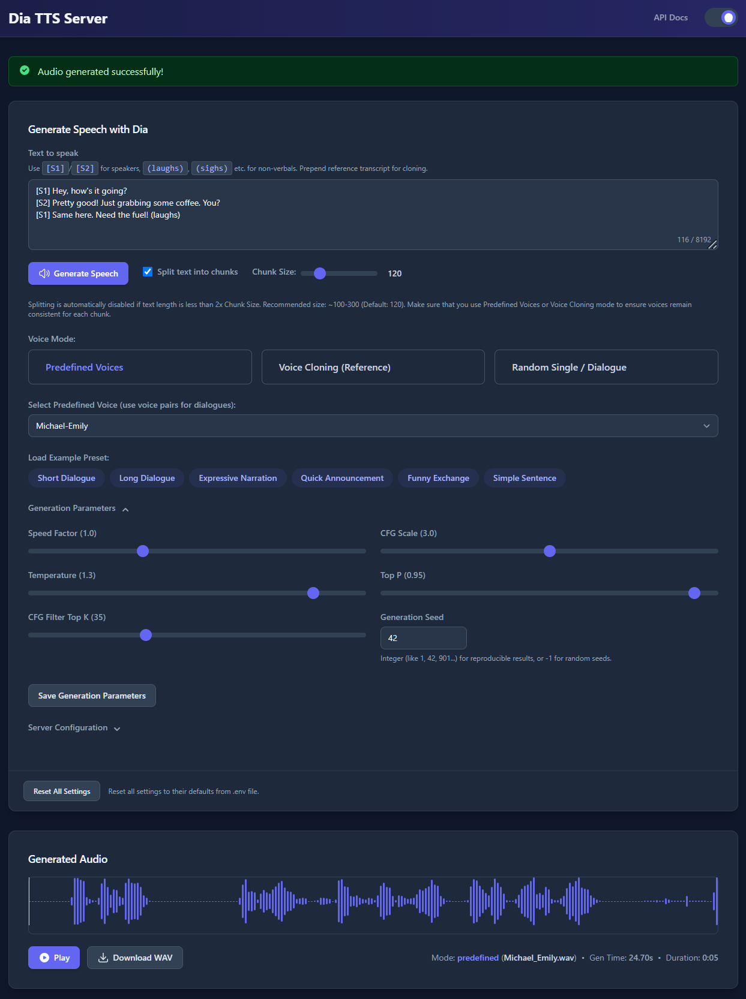
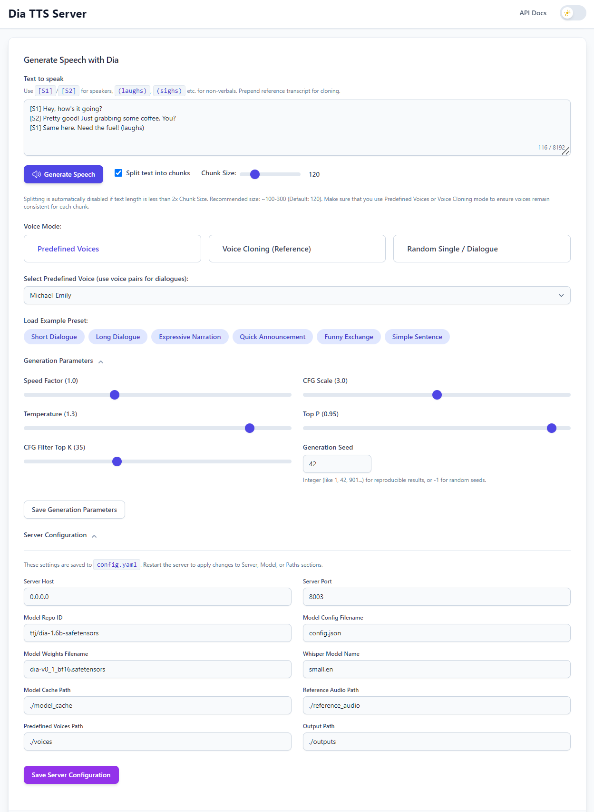

# Dia TTS Server: Multi-Model Support (Dia 1.6B + Dia 2), OpenAI-Compatible API, Web UI & Built-in Voices

**Self-host the powerful [Nari Labs Dia TTS models](https://github.com/nari-labs/dia) — including the original **Dia 1.6B** and the new **Dia 2** family (1B & 2B) — with this enhanced FastAPI server! Features hot-swappable model switching, an intuitive Web UI, flexible API endpoints (including OpenAI-compatible `/v1/audio/speech`), support for realistic dialogue (`[S1]`/`[S2]`), improved voice cloning, large text processing via intelligent chunking, and consistent, reproducible voices using 43 built-in ready-to-use voices and generation seeds feature.**

The latest Dia-TTS-Server version adds multi-model support with the Dia 2 family. Switch between Dia 1.6B, Dia2-1B, and Dia2-2B directly from the Web UI. Defaults to efficient BF16 for reduced VRAM and faster inference. Runs accelerated on NVIDIA GPUs (CUDA) with CPU fallback.

➡️ **Announcing our new TTS project:** Explore the Chatterbox TTS Server and its features: [https://github.com/devnen/Chatterbox-TTS-Server](https://github.com/devnen/Chatterbox-TTS-Server)

[](LICENSE)
[](https://www.python.org/downloads/)
[](https://fastapi.tiangolo.com/)
[](https://github.com/huggingface/safetensors)
[](https://www.docker.com/)
[](#)
[](https://developer.nvidia.com/cuda-zone)
[](https://platform.openai.com/docs/api-reference)

<div align="center">
  
  
</div>

---

## 🗣️ Overview: Enhanced Dia TTS Access

The [Dia TTS models by Nari Labs](https://github.com/nari-labs/dia) — including the original **Dia 1.6B** and the new **Dia 2** family (1B & 2B) — provide incredible capabilities for generating realistic dialogue, complete with speaker turns and non-verbal sounds like `(laughs)` or `(sighs)`. This project builds upon that foundation by providing a robust **[FastAPI](https://fastapi.tiangolo.com/) server** with hot-swappable multi-model support that makes Dia significantly easier to use and integrate.

We solve the complexity of setting up and running the model by offering:

*   An **OpenAI-compatible API endpoint**, allowing you to use Dia TTS with tools expecting OpenAI's API structure.
*   A **modern Web UI** for easy experimentation, preset loading, reference audio management, and generation parameter tuning. The interface design draws inspiration from **[Lex-au's Orpheus-FastAPI project](https://github.com/Lex-au/Orpheus-FastAPI)**, adapting its intuitive layout and user experience for Dia TTS.
*   **Large Text Handling:** Intelligently splits long text inputs into manageable chunks based on sentence structure and speaker tags, processes them sequentially, and seamlessly concatenates the audio.
*   **Predefined Voices:** Select from 43 curated, ready-to-use synthetic voices for consistent and reliable output without cloning setup.
*   **Improved Voice Cloning:** Enhanced pipeline with automatic audio processing and transcript handling (local `.txt` file or experimental Whisper fallback).
*   **Consistent Generation:** Achieve consistent voice output across multiple generations or text chunks by using the "Predefined Voices" or "Voice Cloning" modes, optionally combined with a fixed integer **Seed**.
*   Support for both original `.pth` weights and modern, secure **[SafeTensors](https://github.com/huggingface/safetensors)**, defaulting to a **BF16 SafeTensors** version which uses roughly half the VRAM and offers improved speed.
*   Automatic **GPU (CUDA) acceleration** detection with fallback to CPU.
*   Configuration primarily via `config.yaml`, with `.env` used for initial setup/reset.
*   **Docker support** for easy containerized deployment with [Docker](https://www.docker.com/).

This server is your gateway to leveraging Dia's advanced TTS capabilities seamlessly, now with enhanced stability, voice consistency, and large text support.

## 🆕 What's New

### 🔁 Dia 2 Multi-Model Support (v2.0.0)

- **Dia 2 Model Support:** Added full support for Nari Labs' **Dia 2** family — both **Dia2-1B** (streaming, ~1B params) and **Dia2-2B** (high quality, ~2B params) — alongside the original Dia 1.6B model.
- **Hot-Swappable Model Switching:** Switch between all three models directly from the Web UI without restarting the server. The new model selector dropdown sits above the main generation card with real-time status indicators.
- **Background Model Loading:** Model downloads and loading happen in a background thread — the server stays responsive while switching models. A progress modal shows download/loading phases in real-time.
- **Per-Speaker Voice Conditioning (Dia 2):** Dia 2 uses a modern prefix-speaker conditioning approach instead of Dia 1's `audio_prompt` method, enabling independent voice references for each speaker.
- **Model Registry Architecture:** All models are defined in a centralized `MODEL_REGISTRY` with metadata (HuggingFace repo IDs, parameter counts, voice modes, cloning methods). The engine automatically resolves both friendly selector names and full repo IDs.
- **Cancellable Downloads:** Cancel in-progress model downloads via the UI when you change your mind mid-switch.
- **New API Endpoints:**
    - `POST /restart_server` — async model hot-swap (returns immediately)
    - `GET /api/model-info` — current model details
    - `GET /api/model-registry` — all available models for dropdown
    - `GET /api/model-status` — download/loading progress (UI polls this)
    - `POST /api/cancel-loading` — cancel in-progress model load
    - `POST /api/unload` — unload current model and free resources
- **Defensive Package Imports:** Dia 1 and Dia 2 packages are imported with `try/except` — if either is not installed, only that model shows as unavailable in the UI. The server still works with whichever package(s) are installed.

### ✨ Previous Release (v1.4.0)

**🚀 New Features:**

*   **Large Text Processing (Chunking):**
    *   Automatically handles long text inputs by intelligently splitting them into smaller chunks based on sentence boundaries and speaker tags (`[S1]`/`[S2]`).
    *   Processes each chunk individually and seamlessly concatenates the resulting audio, overcoming previous generation limits.
    *   Configurable via UI toggle ("Split text into chunks") and chunk size slider.
*   **Predefined Voices:**
    *   Added support for using 43 curated, ready-to-use synthetic voices stored in the `./voices` directory.
    *   Selectable via UI dropdown ("Predefined Voices" mode). Server automatically uses required transcripts.
    *   Provides reliable voice output without manual cloning setup and avoids potential licensing issues.
*   **Enhanced Voice Cloning:**
    *   Improved backend pipeline for robustness.
    *   Automatic reference audio processing: mono conversion, resampling to 44.1kHz, truncation (~20s).
    *   Automatic transcript handling: Prioritizes local `.txt` file (recommended for accuracy) -> **experimental Whisper generation** if `.txt` is missing. Backend handles transcript prepending automatically.
    *   Robust reference file finding handles case-insensitivity and extensions.
*   **Whisper Integration:** Added `openai-whisper` for automatic transcript generation as an experimental fallback during cloning. Configurable model (`WHISPER_MODEL_NAME` in `config.yaml`).
*   **API Enhancements:**
    *   `/tts` endpoint now supports `transcript` (for explicit clone transcript), `split_text`, `chunk_size`, and `seed`.
    *   `/v1/audio/speech` endpoint now supports `seed`.
*   **Generation Seed:** Added `seed` parameter to UI and API for influencing generation results. Using a fixed integer seed *in combination with* Predefined Voices or Voice Cloning helps maintain consistency across chunks or separate generations. Use -1 for random variation.
*   **Terminal Progress:** Generation of long text (using chunking) now displays a `tqdm` progress bar in the server's terminal window.
*   **UI Configuration Management:** Added UI section to view/edit `config.yaml` settings and save generation defaults.
*   **Configuration System:** Migrated to `config.yaml` for primary runtime configuration, managed via `config.py`. `.env` is now used mainly for initial seeding or resetting defaults.

**🔧 Fixes & Enhancements:**

*   **VRAM Usage Fixed & Optimized:** Resolved memory leaks during inference and significantly reduced VRAM usage (approx. 14GB+ down to ~7GB) through code optimizations, fixing memory leaks, and BF16 default.
*   **Performance:** Significant speed improvements reported (approaching 95% real-time on tested hardware: AMD Ryzen 9 9950X3D + NVIDIA RTX 3090).
*   **Audio Post-Processing:** Automatically applies silence trimming (leading/trailing), internal silence reduction, and unvoiced segment removal (using Parselmouth) to improve audio quality and remove artifacts.
*   **UI State Persistence:** Web UI now saves/restores text input, voice mode selection, file selections, and generation parameters (seed, chunking, sliders) in `config.yaml`.
*   **UI Improvements:** Better loading indicators (shows chunk processing), refined chunking controls, seed input field, theme toggle, dynamic preset loading from `ui/presets.yaml`, warning modals for chunking/generation quality.
*   **Cloning Workflow:** Backend now handles transcript prepending automatically. UI workflow simplified (user selects file, enters target text).
*   **Dependency Management:** Added `tqdm`, `PyYAML`, `openai-whisper`, `parselmouth` to `requirements.txt`.
*   **Code Refactoring:** Aligned internal engine code with refactored `dia` library structure. Updated `config.py` to use `YamlConfigManager`.

## ✅ Features

*   **Core Dia Capabilities (via [Nari Labs Dia](https://github.com/nari-labs/dia)):**
    *   🗣️ Generate multi-speaker dialogue using `[S1]` / `[S2]` tags.
    *   😂 Include non-verbal sounds like `(laughs)`, `(sighs)`, `(clears throat)`.
    *   🎭 Perform voice cloning using reference audio prompts.
*   **Enhanced Server & API:**
    *   ⚡ Built with the high-performance **[FastAPI](https://fastapi.tiangolo.com/)** framework.
    *   🤖 **OpenAI-Compatible API Endpoint** (`/v1/audio/speech`) for easy integration (now includes `seed`).
    *   ⚙️ **Custom API Endpoint** (`/tts`) exposing all Dia generation parameters (now includes `seed`, `split_text`, `chunk_size`, `transcript`).
    *   📄 Interactive API documentation via Swagger UI (`/docs`).
    *   🩺 Health check endpoint (`/health`).
*   **Advanced Generation Features:**
    *   📚 **Large Text Handling:** Intelligently splits long inputs into chunks based on sentences and speaker tags, generates audio for each, and concatenates the results seamlessly. Configurable via `split_text` and `chunk_size`.
    *   🎤 **Predefined Voices:** Select from 43 curated, ready-to-use synthetic voices in the `./voices` directory for consistent output without cloning setup.
    *   ✨ **Improved Voice Cloning:** Robust pipeline with automatic audio processing and transcript handling (local `.txt` or Whisper fallback). Backend handles transcript prepending.
    *   🌱 **Consistent Generation:** Use Predefined Voices or Voice Cloning modes, optionally with a fixed integer **Seed**, for consistent voice output across chunks or multiple requests.
    *   🔇 **Audio Post-Processing:** Automatic steps to trim silence, fix internal pauses, and remove long unvoiced segments/artifacts.
*   **Intuitive Web User Interface:**
    *   🖱️ Modern, easy-to-use interface inspired by **[Lex-au's Orpheus-FastAPI project](https://github.com/Lex-au/Orpheus-FastAPI)**.
    *   💡 **Presets:** Load example text and settings dynamically from `ui/presets.yaml`. Customize by editing the file.
    *   🎤 **Reference Audio Upload:** Easily upload `.wav`/`.mp3` files for voice cloning.
    *   🗣️ **Voice Mode Selection:** Choose between Predefined Voices, Voice Cloning, or Random/Dialogue modes.
    *   🎛️ **Parameter Control:** Adjust generation settings (CFG Scale, Temperature, Speed, Seed, etc.) via sliders and inputs.
    *   💾 **Configuration Management:** View and save server settings (`config.yaml`) and default generation parameters directly in the UI.
    *   💾 **Session Persistence:** Remembers your last used settings via `config.yaml`.
    *   ✂️ **Chunking Controls:** Enable/disable text splitting and adjust approximate chunk size.
    *   ⚠️ **Warning Modals:** Optional warnings for chunking voice consistency and general generation quality.
    *   🌓 **Light/Dark Mode:** Toggle between themes with preference saved locally.
    *   🔊 **Audio Player:** Integrated waveform player ([WaveSurfer.js](https://wavesurfer.xyz/)) for generated audio with download option.
    *   ⏳ **Loading Indicator:** Shows status, including chunk processing information.
*   **Flexible & Efficient Model Handling:**
    *   ☁️ Downloads models automatically from [Hugging Face Hub](https://huggingface.co/).
    *   🔒 Supports loading secure **`.safetensors`** weights (default).
    *   💾 Supports loading original **`.pth`** weights.
    *   🚀 Defaults to **BF16 SafeTensors** for reduced memory footprint (~half size) and potentially faster inference. (Credit: [ttj/dia-1.6b-safetensors](https://huggingface.co/ttj/dia-1.6b-safetensors))
    *   🔄 Easily switch between model formats/versions via `config.yaml`.
*   **Performance & Configuration:**
    *   💻 **GPU Acceleration:** Automatically uses NVIDIA CUDA if available, falls back to CPU. Optimized VRAM usage (~7GB typical).
    *   📊 **Terminal Progress:** Displays `tqdm` progress bar when processing text chunks.
    *   ⚙️ Primary configuration via `config.yaml`, initial seeding via `.env`.
    *   📦 Uses standard Python virtual environments.
*   **Docker Support:**
    *   🐳 Containerized deployment via [Docker](https://www.docker.com/) and Docker Compose.
    *   🔌 NVIDIA GPU acceleration with Container Toolkit integration.
    *   💾 Persistent volumes for models, reference audio, predefined voices, outputs, and config.
    *   🚀 One-command setup and deployment (`docker compose up -d`).

## 🔩 System Prerequisites

*   **Operating System:** Windows 10/11 (64-bit) or Linux (Debian/Ubuntu recommended).
*   **Python:** Version 3.10 or later ([Download](https://www.python.org/downloads/)).
*   **Git:** For cloning the repository ([Download](https://git-scm.com/downloads)).
*   **Internet:** For downloading dependencies and models.
*   **(Optional but HIGHLY Recommended for Performance):**
    *   **NVIDIA GPU:** CUDA-compatible (Maxwell architecture or newer). Check [NVIDIA CUDA GPUs](https://developer.nvidia.com/cuda-gpus). Optimized VRAM usage (~7GB typical), but more helps.
    *   **NVIDIA Drivers:** Latest version for your GPU/OS ([Download](https://www.nvidia.com/Download/index.aspx)).
    *   **CUDA Toolkit:** Compatible version (e.g., 11.8, 12.1) matching the PyTorch build you install.
*   **(Linux Only):**
    *   `libsndfile1`: Audio library needed by `soundfile`. Install via package manager (e.g., `sudo apt install libsndfile1`).
    *   `ffmpeg`: Required by `openai-whisper`. Install via package manager (e.g., `sudo apt install ffmpeg`).

## 💻 Installation and Setup

Follow these steps carefully to get the server running.

**1. Clone the Repository**
```bash
git clone https://github.com/devnen/dia-tts-server.git
cd dia-tts-server
```

**2. Set up Python Virtual Environment**

Using a virtual environment is crucial!

*   **Windows (PowerShell):**
    ```powershell
    # In the dia-tts-server directory
    python -m venv venv
    .\venv\Scripts\activate
    # Your prompt should now start with (venv)
    ```

*   **Linux (Bash - Debian/Ubuntu Example):**
    ```bash
    # Ensure prerequisites are installed
    sudo apt update && sudo apt install python3 python3-venv python3-pip libsndfile1 ffmpeg -y

    # In the dia-tts-server directory
    python3 -m venv venv
    source venv/bin/activate
    # Your prompt should now start with (venv)
    ```

**3. Install Dependencies**

Make sure your virtual environment is activated (`(venv)` prefix visible).

```bash
# Upgrade pip (recommended)
pip install --upgrade pip

# Install project requirements (includes tqdm, yaml, parselmouth etc.)
pip install -r requirements.txt
```
⭐ **Note:** This installation includes large libraries like PyTorch. The download and installation process may take some time depending on your internet speed and system performance.

⭐ **Important:** This installs the *CPU-only* version of PyTorch by default. If you have an NVIDIA GPU, proceed to Step 4 **before** running the server for GPU acceleration.

**4. NVIDIA Driver and CUDA Setup (for GPU Acceleration)**

Skip this step if you only have a CPU.

*   **Step 4a: Check/Install NVIDIA Drivers**
    *   Run `nvidia-smi` in your terminal/command prompt.
    *   If it works, note the **CUDA Version** listed (e.g., 12.1, 11.8). This is the *maximum* your driver supports.
    *   If it fails, download and install the latest drivers from [NVIDIA Driver Downloads](https://www.nvidia.com/Download/index.aspx) and **reboot**. Verify with `nvidia-smi` again.

*   **Step 4b: Install PyTorch with CUDA Support**
    *   Go to the [Official PyTorch Website](https://pytorch.org/get-started/locally/).
    *   Use the configuration tool: Select **Stable**, **Windows/Linux**, **Pip**, **Python**, and the **CUDA version** that is **equal to or lower** than the one shown by `nvidia-smi` (e.g., if `nvidia-smi` shows 12.4, choose CUDA 12.1).
    *   Copy the generated command (it will include `--index-url https://download.pytorch.org/whl/cuXXX`).
    *   **In your activated `(venv)`:**
        ```bash
        # Uninstall the CPU version first!
        pip uninstall torch torchvision torchaudio -y

        # Paste and run the command copied from the PyTorch website
        # Example (replace with your actual command):
        pip install torch torchvision torchaudio --index-url https://download.pytorch.org/whl/cu121
        ```

*   **Step 4c: Verify PyTorch CUDA Installation**
    *   In your activated `(venv)`, run `python` and execute the following single line:
        ```python
        import torch; print(f"PyTorch version: {torch.__version__}"); print(f"CUDA available: {torch.cuda.is_available()}"); print(f"Device name: {torch.cuda.get_device_name(0)}") if torch.cuda.is_available() else None; exit()
        ```
    *   If `CUDA available:` shows `True`, the setup was successful. If `False`, double-check driver installation and the PyTorch install command.

## ⚙️ Configuration

The server now primarily uses `config.yaml` for runtime configuration.

*   **`config.yaml`:** Located in the project root. This file stores all server settings, model paths, generation defaults, and UI state. It is created automatically on the first run if it doesn't exist. **This is the main file to edit for persistent configuration changes.**
*   **`.env` File:** Used **only** for the *initial creation* of `config.yaml` if it's missing, or when using the "Reset All Settings" button in the UI. Values in `.env` override hardcoded defaults during this initial seeding/reset process. It is **not** read during normal server operation once `config.yaml` exists.
*   **UI Configuration:** The "Server Configuration" and "Generation Parameters" sections in the Web UI allow direct editing and saving of values *into* `config.yaml`.

**Key Configuration Areas (in `config.yaml` or UI):**

*   `server`: `host`, `port`
*   `model`: `repo_id`, `config_filename`, `weights_filename`, `whisper_model_name`
*   `paths`: `model_cache`, `reference_audio`, `output`, `voices` (for predefined)
*   `generation_defaults`: Default values for sliders/seed in the UI (`speed_factor`, `cfg_scale`, `temperature`, `top_p`, `cfg_filter_top_k`, `seed`, `split_text`, `chunk_size`).
*   `ui_state`: Stores the last used text, voice mode, file selections, etc., for UI persistence.

⭐ **Remember:** Changes made to `server`, `model`, or `paths` sections in `config.yaml` (or via the UI) **require a server restart** to take effect. Changes to `generation_defaults` or `ui_state` are applied dynamically or on the next page load.

## ▶️ Running the Server

**Note on Model Downloads:**
The first time you run the server (or after changing model settings in `config.yaml`), it will download the required Dia and Whisper model files (~3-7GB depending on selection). Monitor the terminal logs for progress. The server starts fully *after* downloads complete.

1.  **Activate the virtual environment (if not activated):**
    *   Linux/macOS: `source venv/bin/activate`
    *   Windows: `.\venv\Scripts\activate`
2.  **Run the server:**
    ```bash
    python server.py
    ```
3.  **Access the UI:** The server should automatically attempt to open the Web UI in your default browser after startup. If it doesn't for any reason, manually navigate to `http://localhost:PORT` (e.g., `http://localhost:8003`).
4.  **Access API Docs:** Open `http://localhost:PORT/docs`.
5.  **Stop the server:** Press `CTRL+C` in the terminal.

---

## 🐳 Docker Installation

Run Dia TTS Server easily using Docker. The recommended method uses Docker Compose with pre-built images from GitHub Container Registry (GHCR).

### Prerequisites

*   [Docker](https://docs.docker.com/get-docker/) installed.
*   [Docker Compose](https://docs.docker.com/compose/install/) installed (usually included with Docker Desktop).
*   (Optional but Recommended for GPU) NVIDIA GPU with up-to-date drivers and the [NVIDIA Container Toolkit](https://docs.nvidia.com/datacenter/cloud-native/container-toolkit/install-guide.html) installed.

### Option 1: Using Docker Compose (Recommended)

This method uses `docker-compose.yml` to manage the container, volumes, and configuration easily. It leverages pre-built images hosted on GHCR.

1.  **Clone the repository:** (You only need the `docker-compose.yml` and `env.example.txt` files from it)
    ```bash
    git clone https://github.com/devnen/dia-tts-server.git
    cd dia-tts-server
    ```

2.  **(Optional) Initial Configuration via `.env`:**
    *   If this is your very first time running the container and you want to override the default settings *before* `config.yaml` is created inside the container, copy the example environment file:
        ```bash
        cp env.example.txt .env
        ```
    *   Edit the `.env` file with your desired initial settings (e.g., `PORT`, model filenames).
    *   **Note:** This `.env` file is *only* used to seed the *initial* `config.yaml` on the very first container start if `/app/config.yaml` doesn't already exist inside the container's volume (which it won't initially). Subsequent configuration changes should be made via the UI or by editing `config.yaml` directly (see Configuration Note below).

3.  **Review `docker-compose.yml`:**
    *   The repository includes a `docker-compose.yml` file configured to use the pre-built image and recommended settings. Ensure it looks similar to this:

        ```yaml
        # docker-compose.yml
        version: '3.8'

        services:
          dia-tts-server:
            # Use the pre-built image from GitHub Container Registry
            image: ghcr.io/devnen/dia-tts-server:latest
            # Alternatively, to build locally (e.g., for development):
            # build:
            #   context: .
            #   dockerfile: Dockerfile
            ports:
              # Map host port (default 8003) to container port 8003
              # You can change the host port via .env (e.g., PORT=8004)
              - "${PORT:-8003}:8003"
            volumes:
              # Mount local directories into the container for persistent data
              - ./model_cache:/app/model_cache
              - ./reference_audio:/app/reference_audio
              - ./outputs:/app/outputs
              - ./voices:/app/voices
              # DO NOT mount config.yaml - let the app create it inside

            # --- GPU Access ---
            # Modern method (Recommended for newer Docker/NVIDIA setups)
            devices:
              - nvidia.com/gpu=all
            device_cgroup_rules:
              - "c 195:* rmw" # Needed for some NVIDIA container toolkit versions
              - "c 236:* rmw" # Needed for some NVIDIA container toolkit versions

            # Legacy method (Alternative for older Docker/NVIDIA setups)
            # If the 'devices' block above doesn't work, comment it out and uncomment
            # the 'deploy' block below. Do not use both simultaneously.
            # deploy:
            #   resources:
            #     reservations:
            #       devices:
            #         - driver: nvidia
            #           count: 1 # Or specify specific GPUs e.g., "device=0,1"
            #           capabilities: [gpu]
            # --- End GPU Access ---

            restart: unless-stopped
            env_file:
              # Load environment variables from .env file for initial config seeding
              - .env
            environment:
              # Enable faster Hugging Face downloads inside the container
              - HF_HUB_ENABLE_HF_TRANSFER=1
              # Pass GPU capabilities (may be needed for legacy method if uncommented)
              - NVIDIA_VISIBLE_DEVICES=all
              - NVIDIA_DRIVER_CAPABILITIES=compute,utility

        # Optional: Define named volumes if you prefer them over host mounts
        # volumes:
        #   model_cache:
        #   reference_audio:
        #   outputs:
        #   voices:
        ```

4.  **Start the container:**
    ```bash
    docker compose up -d
    ```
    *   This command will:
        *   Pull the latest `ghcr.io/devnen/dia-tts-server:latest` image.
        *   Create the local directories (`model_cache`, `reference_audio`, `outputs`, `voices`) if they don't exist.
        *   Start the container in detached mode (`-d`).
    *   The first time you run this, it will download the TTS models into `./model_cache`, which may take some time depending on your internet speed.

5.  **Access the UI:**
    Open your web browser to `http://localhost:8003` (or the host port you configured in `.env`).

6.  **View logs:**
    ```bash
    docker compose logs -f
    ```

7.  **Stop the container:**
    ```bash
    docker compose down
    ```

### Option 2: Using `docker run` (Alternative)

This method runs the container directly without Docker Compose, requiring manual specification of ports, volumes, and GPU flags.

```bash
# Ensure local directories exist first:
# mkdir -p model_cache reference_audio outputs voices

docker run -d \
  --name dia-tts-server \
  -p 8003:8003 \
  -v ./model_cache:/app/model_cache \
  -v ./reference_audio:/app/reference_audio \
  -v ./outputs:/app/outputs \
  -v ./voices:/app/voices \
  --env HF_HUB_ENABLE_HF_TRANSFER=1 \
  --gpus all \
  ghcr.io/devnen/dia-tts-server:latest
```

*   Replace `8003:8003` with `<your_host_port>:8003` if needed.
*   `--gpus all` enables GPU access; consult NVIDIA Container Toolkit documentation for alternatives if needed.
*   Initial configuration relies on model defaults unless you pass environment variables using multiple `-e VAR=VALUE` flags (more complex than using `.env` with Compose).

### Configuration Note

*   The server uses `config.yaml` inside the container (`/app/config.yaml`) for its settings.
*   On the *very first start*, if `/app/config.yaml` doesn't exist, the server creates it using defaults from the code, potentially overridden by variables in the `.env` file (if using Docker Compose and `.env` exists).
*   **After the first start,** changes should be made by:
    *   Using the Web UI's settings page (if available).
    *   Editing the `config.yaml` file *inside* the container (e.g., `docker compose exec dia-tts-server nano /app/config.yaml`). Changes require a container restart (`docker compose restart dia-tts-server`) to take effect for server/model/path settings. UI state changes are saved live.

### Performance Optimizations

*   **Faster Model Downloads**: `hf-transfer` is enabled by default in the provided `docker-compose.yml` and image, significantly speeding up initial model downloads from Hugging Face.
*   **GPU Acceleration**: The `docker-compose.yml` and `docker run` examples include flags (`devices` or `--gpus`) to enable NVIDIA GPU acceleration if available. The Docker image uses a CUDA runtime base for efficiency.

### Docker Volumes

Persistent data is stored on your host machine via volume mounts:

*   `./model_cache:/app/model_cache` (Downloaded TTS and Whisper models)
*   `./reference_audio:/app/reference_audio` (Your uploaded reference audio files for cloning)
*   `./outputs:/app/outputs` (Generated audio files)
*   `./voices:/app/voices` (Predefined voice audio files)

### Available Images

*   **GitHub Container Registry**: `ghcr.io/devnen/dia-tts-server:latest` (Automatically built from the `main` branch)

---

## 💡 Usage

### Web UI (`http://localhost:PORT`)

The most intuitive way to use the server:

*   **Text Input:** Enter your script. Use `[S1]`/`[S2]` for dialogue and non-verbals like `(laughs)`. Content is saved automatically.
*   **Generate Button & Chunking:** Click "Generate Speech". Below the text box:
    *   **Split text into chunks:** Toggle checkbox (enabled by default). Enables splitting for long text (> ~2x chunk size).
    *   **Chunk Size:** Adjust the slider (visible when splitting is possible) for approximate chunk character length (default 120).
*   **Voice Mode:** Choose:
    *   `Predefined Voices`: Select a curated, ready-to-use synthetic voice from the `./voices` directory.
    *   `Voice Cloning`: Select an uploaded reference file from `./reference_audio`. Requires a corresponding `.txt` transcript (recommended) or relies on experimental Whisper fallback. Backend handles transcript automatically.
    *   `Random Single / Dialogue`: Uses `[S1]`/`[S2]` tags or generates a random voice if no tags. Use a fixed Seed for consistency.
*   **Presets:** Click buttons (loaded from `ui/presets.yaml`) to populate text and parameters. Customize by editing the YAML file.
*   **Reference Audio (Clone Mode):** Select an existing `.wav`/`.mp3` or click "Import" to upload new files to `./reference_audio`.
*   **Generation Parameters:** Adjust sliders/inputs for Speed, CFG, Temperature, Top P, Top K, and **Seed**. Settings are saved automatically. Click "Save Generation Parameters" to update the defaults in `config.yaml`. Use -1 seed for random, integer for specific results.
*   **Server Configuration:** View/edit `config.yaml` settings (requires server restart for some changes).
*   **Loading Overlay:** Appears during generation, showing chunk progress if applicable.
*   **Audio Player:** Appears on success with waveform, playback controls, download link, and generation info.
*   **Theme Toggle:** Switch between light/dark modes.

### API Endpoints (`/docs` for details)

*   **`/v1/audio/speech` (POST):** OpenAI-compatible.
    *   `input`: Text.
    *   `voice`: 'S1', 'S2', 'dialogue', 'predefined_voice_filename.wav', or 'reference_filename.wav'.
    *   `response_format`: 'opus' or 'wav'.
    *   `speed`: Playback speed factor (0.5-2.0).
    *   `seed`: (Optional) Integer seed, -1 for random.
*   **`/tts` (POST):** Custom endpoint with full control.
    *   `text`: Target text.
    *   `voice_mode`: 'dialogue', 'single_s1', 'single_s2', 'clone', 'predefined'.
    *   `clone_reference_filename`: Filename in `./reference_audio` (for clone) or `./voices` (for predefined).
    *   `transcript`: (Optional, Clone Mode Only) Explicit transcript text to override file/Whisper lookup.
    *   `output_format`: 'opus' or 'wav'.
    *   `max_tokens`: (Optional) Max tokens *per chunk*.
    *   `cfg_scale`, `temperature`, `top_p`, `cfg_filter_top_k`: Generation parameters.
    *   `speed_factor`: Playback speed factor (0.5-2.0).
    *   `seed`: (Optional) Integer seed, -1 for random.
    *   `split_text`: (Optional) Boolean, enable/disable chunking (default: True).
    *   `chunk_size`: (Optional) Integer, target chunk size (default: 120).

## 🔍 Troubleshooting

*   **CUDA Not Available / Slow:** Check NVIDIA drivers (`nvidia-smi`), ensure correct CUDA-enabled PyTorch is installed (Installation Step 4).
*   **VRAM Out of Memory (OOM):**
    *   Ensure you are using the BF16 model (`dia-v0_1_bf16.safetensors` in `config.yaml`) if VRAM is limited (~7GB needed).
    *   Close other GPU-intensive applications. VRAM optimizations and leak fixes have significantly reduced requirements.
    *   If processing very long text even with chunking, try reducing `chunk_size` (e.g., 100).
*   **CUDA Out of Memory (OOM) During Startup:** This can happen due to temporary overhead. The server loads weights to CPU first to mitigate this. If it persists, check VRAM usage (`nvidia-smi`), ensure BF16 model is used, or try setting `PYTORCH_CUDA_ALLOC_CONF=expandable_segments:True` environment variable before starting.
*   **Import Errors (`dac`, `tqdm`, `yaml`, `whisper`, `parselmouth`):** Activate venv, run `pip install -r requirements.txt`. Ensure `descript-audio-codec` installed correctly.
*   **`libsndfile` / `ffmpeg` Error (Linux):** Run `sudo apt install libsndfile1 ffmpeg`.
*   **Model Download Fails (Dia or Whisper):** Check internet, `config.yaml` settings (`model.repo_id`, `model.weights_filename`, `model.whisper_model_name`), Hugging Face status, cache path permissions (`paths.model_cache`).
*   **Voice Cloning Fails / Poor Quality:**
    *   **Ensure accurate `.txt` transcript exists** alongside the reference audio in `./reference_audio`. Format: `[S1] text...` or `[S1] text... [S2] text...`. This is the most reliable method.
    *   Whisper fallback is experimental and may be inaccurate.
    *   Use clean, clear reference audio (5-20s).
    *   Check server logs for specific errors during `_prepare_cloning_inputs`.
*   **Permission Errors (Saving Files/Config):** Check write permissions for `paths.output`, `paths.reference_audio`, `paths.voices`, `paths.model_cache` (for Whisper transcript saves), and `config.yaml`.
*   **UI Issues / Settings Not Saving:** Clear browser cache/local storage. Check developer console (F12) for JS errors. Ensure `config.yaml` is writable by the server process.
*   **Inconsistent Voice with Chunking:** Use "Predefined Voices" or "Voice Cloning" mode. If using "Random/Dialogue" mode with splitting, use a fixed integer `seed` (not -1) for consistency across chunks. The UI provides a warning otherwise.
*   **Port Conflict (`Address already in use` / `Errno 98`):** Another process is using the port (default 8003). Stop the other process or change the `server.port` in `config.yaml` (requires restart).
    *   **Explanation:** This usually happens if a previous server instance didn't shut down cleanly or another application is bound to the same port.
    *   **Linux:** Find/kill process: `sudo lsof -i:PORT | grep LISTEN | awk '{print $2}' | xargs kill -9` (Replace PORT, e.g., 8003).
    *   **Windows:** Find/kill process: `for /f "tokens=5" %i in ('netstat -ano ^| findstr :PORT') do taskkill /F /PID %i` (Replace PORT, e.g., 8003). Use with caution.
*   **Generation Cancel Button:** This is a "UI Cancel" - it stops the *frontend* from waiting but doesn't instantly halt ongoing backend model inference. Clicking Generate again cancels the previous UI wait.

### Selecting GPUs on Multi-GPU Systems

Set the `CUDA_VISIBLE_DEVICES` environment variable **before** running `python server.py` to specify which GPU(s) PyTorch should see. The server uses the first visible one (`cuda:0`).

*   **Example (Use only physical GPU 1):**
    *   Linux/macOS: `CUDA_VISIBLE_DEVICES="1" python server.py`
    *   Windows CMD: `set CUDA_VISIBLE_DEVICES=1 && python server.py`
    *   Windows PowerShell: `$env:CUDA_VISIBLE_DEVICES="1"; python server.py`

*   **Example (Use physical GPUs 6 and 7 - server uses GPU 6):**
    *   Linux/macOS: `CUDA_VISIBLE_DEVICES="6,7" python server.py`
    *   Windows CMD: `set CUDA_VISIBLE_DEVICES=6,7 && python server.py`
    *   Windows PowerShell: `$env:CUDA_VISIBLE_DEVICES="6,7"; python server.py`

**Note:** `CUDA_VISIBLE_DEVICES` selects GPUs; it does **not** fix OOM errors if the chosen GPU lacks sufficient memory.

## 🤝 Contributing

Contributions are welcome! Please feel free to open an issue to report bugs or suggest features, or submit a Pull Request for improvements.

## 📜 License

This project is licensed under the **MIT License**.

You can find it here: [https://opensource.org/licenses/MIT](https://opensource.org/licenses/MIT)

## 🙏 Acknowledgements

*   **Core Model:** This project heavily relies on the excellent **[Dia TTS model](https://github.com/nari-labs/dia)** developed by **[Nari Labs](https://github.com/nari-labs)**. Their work in creating and open-sourcing the model is greatly appreciated.
*   **UI Inspiration:** Special thanks to **[Lex-au](https://github.com/Lex-au)** whose **[Orpheus-FastAPI](https://github.com/Lex-au/Orpheus-FastAPI)** project served as inspiration for the web interface design of this project.
*   **SafeTensors Conversion:** Thank you to user **[ttj on Hugging Face](https://huggingface.co/ttj)** for providing the converted **[SafeTensors weights](https://huggingface.co/ttj/dia-1.6b-safetensors)** used as the default in this server.
*   **Containerization Technologies:** [Docker](https://www.docker.com/) and [NVIDIA Container Toolkit](https://github.com/NVIDIA/nvidia-docker) for enabling consistent deployment environments.
*   **Core Libraries:**
    *   [FastAPI](https://fastapi.tiangolo.com/)
    *   [Uvicorn](https://www.uvicorn.org/)
    *   [PyTorch](https://pytorch.org/)
    *   [Hugging Face Hub](https://huggingface.co/docs/huggingface_hub/index) & [SafeTensors](https://github.com/huggingface/safetensors)
    *   [Descript Audio Codec (DAC)](https://github.com/descriptinc/descript-audio-codec)
    *   [SoundFile](https://python-soundfile.readthedocs.io/) & [libsndfile](http://www.mega-nerd.com/libsndfile/)
    *   [Jinja2](https://jinja.palletsprojects.com/)
    *   [WaveSurfer.js](https://wavesurfer.xyz/)
    *   [Tailwind CSS](https://tailwindcss.com/) (via CDN)

---
